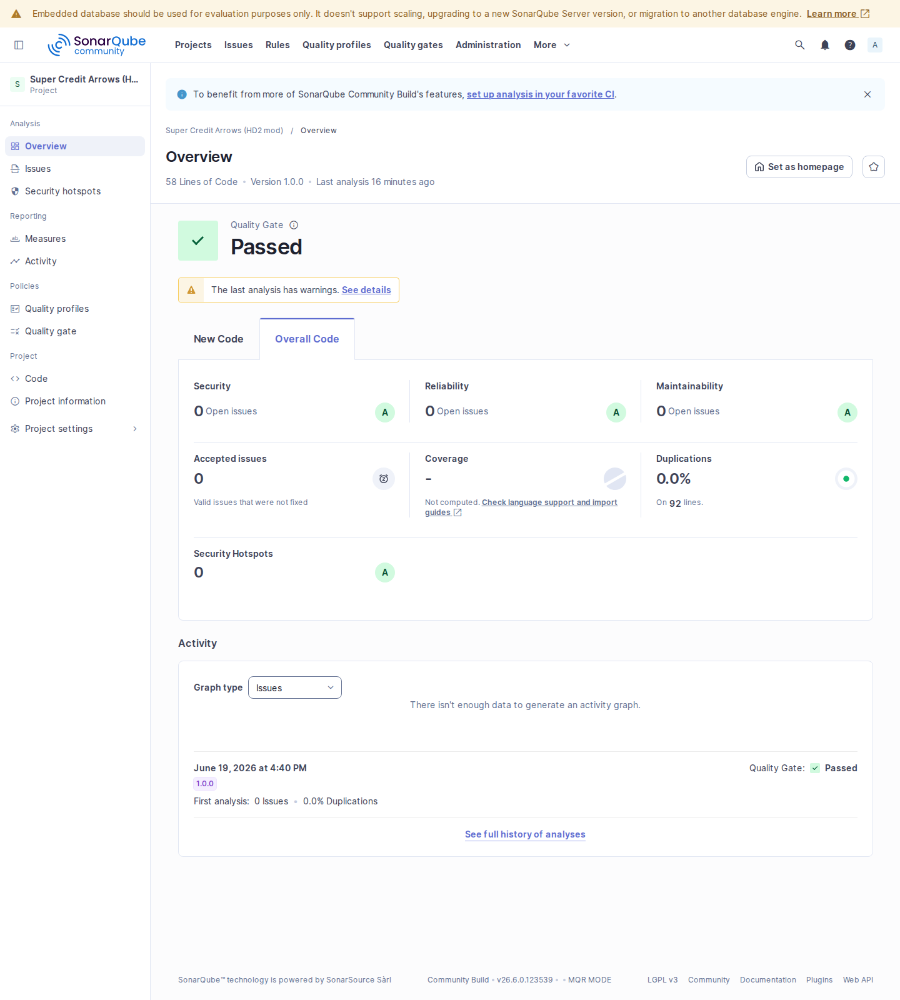

# Super Credit Arrows (hd2-sc-arrow)


Helldivers 2 mod that puts arrows above Super Credit piles, with a target menu:
**blue arrows = Super Credits, purple arrows = Samples**.

Fork of [Giovani1906/hd2-sc-arrow](https://github.com/Giovani1906/hd2-sc-arrow).
This fork adds a local DevSecOps baseline (SonarQube scan, evidence,
install/revert scripts) and a blue/purple target menu. The blue Super Credit
arrows are the upstream patches, unchanged. The purple Sample arrows are a
preview: the menu is wired but the sample patches are not built yet (see
[`docs/ROADMAP.md`](docs/ROADMAP.md)).

## Code status

Last scan: 2026-06-19. Self-hosted SonarQube Community (server from the local
credential store). Numbers from [`docs/evidence/sonar-report.txt`](docs/evidence/sonar-report.txt).

| Metric | Value |
|---|---|
| Quality gate | OK |
| Bugs | 0 |
| Vulnerabilities | 0 |
| Security hotspots | 0 |
| Code smells | 0 |
| Security rating | A |
| Reliability rating | A |
| Maintainability rating | A |
| Coverage | N/A (no unit tests; binary mod) |
| Packaging check | pass ([`manifest-pull.txt`](docs/evidence/manifest-pull.txt)) |



Gate evidenced by the dashboard above, [`sonar-report.txt`](docs/evidence/sonar-report.txt),
the scrubbed scanner log [`sonar-scan-log.txt`](docs/evidence/sonar-scan-log.txt),
and the [`sonar-issues.png`](docs/evidence/sonar-issues.png) /
[`sonar-measures.png`](docs/evidence/sonar-measures.png) screenshots.

## Status

| Area | State |
|---|---|
| Blue = Super Credit arrows | works (upstream patches); glow / no-glow |
| Purple = Sample arrows | menu present; **preview** — no arrow renders yet |
| Target menu (blue/purple) | works in HD2ModManager EDIT |
| Sample patches | not built; toolchain set up (see [`docs/ROADMAP.md`](docs/ROADMAP.md)) |
| SonarQube gate | passing |

## How it works

The mod replaces the Super Credit `unit` with a copy that has an arrow mesh and
bob animation baked in, injected through the `packages/boot` package (patch file
`9ba626afa44a3aa3`). Each appearance variant lives in its own folder
(`blue/glow`, `blue/no_glow`, `purple/glow`, `purple/no_glow`).

### Install

Use [HD2ModManager](https://www.nexusmods.com/helldivers2/mods/109?tab=files):
`Add` the mod archive, enable it, optionally `EDIT` the appearance, then
`Deploy`.

Manual / scripted:

```bash
scripts/install.sh blue/glow /path/to/Helldivers\ 2   # blue = Super Credits; or set HD2_GAME_PATH
```

### Revert

```bash
scripts/revert-mods.sh /path/to/Helldivers\ 2           # removes only this mod's patches
```

Back up the data dir first: `cp -a "$GAME/data" "$GAME/data.bak"`.

## Validation Reports

### Tested environments

| Environment | Result |
|---|---|
| SonarQube Community (self-hosted, container scanner via podman) | gate OK |
| Manifest/packaging vs HD2ModManager ingest model | pass |

### Checklist

- [x] `manifest.json` deserializes as a Version 1 manifest
- [x] all patch files match the manager's deploy pattern
- [x] SonarQube scan runs and the quality gate passes
- [ ] in-game arrow render confirmed on the current build (manual)
- [ ] Sample arrows implemented (roadmap)

### Report log

- 2026-06-19 — v2: added the blue/purple target menu (blue = Super Credits,
  functional; purple = Samples, preview). Packaging re-validated; SonarQube gate OK.
- 2026-06-19 — Baseline applied to the fork. SonarQube scan: gate OK, 0 bugs /
  0 vulnerabilities / 0 hotspots / 0 code smells, ratings A/A/A. Packaging
  validated against the mod manager's model. Evidence in `docs/evidence/`.

## Validation and DevSecOps

The pipeline is local shell scripts; there is no CI service. See
[`docs/TESTING.md`](docs/TESTING.md) for how this mod is tested.

- **Test** — packaging and install/revert checks (`docs/TESTING.md`).
- **Scan** — `scripts/sonar.sh` (scan + quality gate),
  `scripts/sonar-evidence.sh` (UI screenshots). Server URL and token come from
  the local credential store (KWallet) at run time.
- **Deploy / revert** — `scripts/install.sh` installs a variant;
  `scripts/revert-mods.sh` removes only this mod's patches.

## Security

- No bugs, vulnerabilities, or security hotspots reported by SonarQube
  (`docs/evidence/sonar-report.txt`).
- No secrets, server URLs, or machine paths in the repo; the scan scripts read
  the SonarQube URL and token from KWallet at run time.

## Relationship to upstream

Fork of [Giovani1906/hd2-sc-arrow](https://github.com/Giovani1906/hd2-sc-arrow).
The mod content (manifest, patches, thumbnail) is upstream's. This fork adds the
DevSecOps baseline, scripts, docs, and evidence. License follows upstream.
